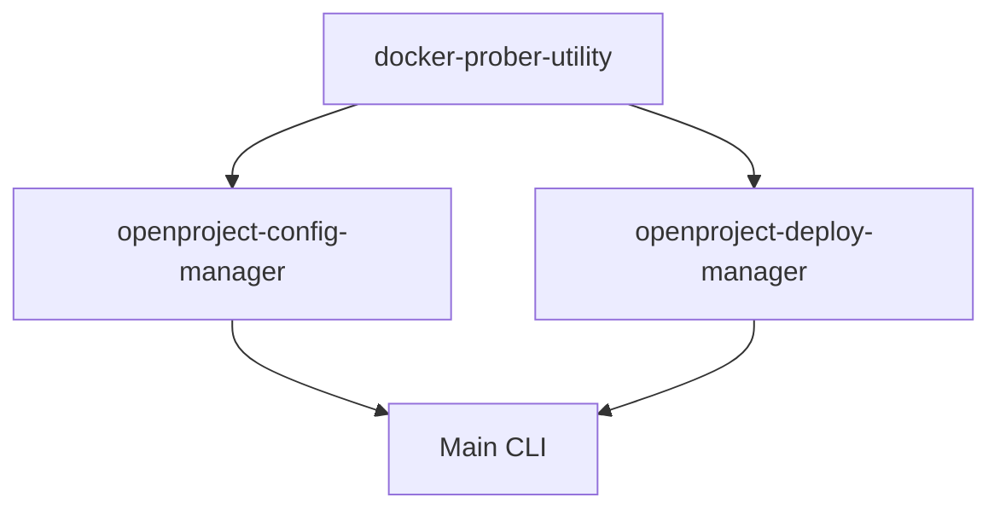
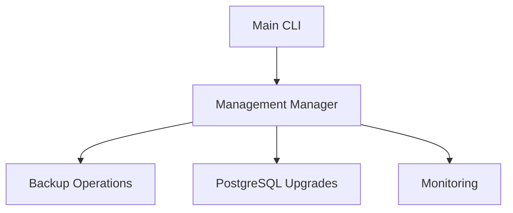

# Multi-Repository Manager Architecture

This folder structure clearly separates the **four main components** of the OpenProject Python rebuild project, making the modular architecture visible and organized.

## 📁 Folder Structure Overview

```
openproject-docker-compose/          # Main repository
├── Configuration/                   # Configuration Manager (documentation)
│   ├── README.md                    # Architecture and integration docs
│   └── examples/                    # Usage examples
├── Deployment/                      # Deployment Manager (documentation + templates)
│   ├── README.md                    # Architecture and integration docs
│   └── templates/                   # OpenProject-specific Jinja2 templates
│       └── Caddyfile.template.j2    # Caddy proxy configuration
├── Prober/                         # Prober Utility (documentation)
│   ├── README.md                   # Architecture and integration docs
│   └── examples/                   # Usage examples
├── Management/                     # Management Manager (implementation)
│   ├── README.md                   # Architecture and implementation docs
│   ├── backup/                     # Backup operations
│   ├── upgrade/                    # PostgreSQL upgrades
│   ├── migration/                  # Database migrations
│   └── monitoring/                 # Health monitoring
│
├── external/                       # Git submodules (actual implementations)
│   ├── config-manager/             # openproject-config-manager repo
│   ├── deploy-manager/             # openproject-deploy-manager repo
│   └── prober/                     # docker-prober-utility repo
│
└── src/openproject_deploy/         # Main integration code
    ├── cli.py                      # CLI orchestration
    ├── config_manager.py          # (legacy, moving to external)
    └── utils/
```

## 🎯 Purpose of Each Component

### **Configuration/** 📋
- **Repository**: External (`openproject-config-manager`)
- **Purpose**: Interactive configuration discovery and management
- **Key Features**: Environment probing, Rich UI, live validation
- **Contents**: Documentation and integration examples

### **Deployment/** 🚀
- **Repository**: External (`openproject-deploy-manager`)
- **Purpose**: Deployment orchestration with health checking
- **Key Features**: Template rendering, Docker orchestration, rollback
- **Contents**: Documentation, integration guides, and OpenProject-specific templates

### **Prober/** 🔍
- **Repository**: External (`docker-prober-utility`)
- **Purpose**: HTTP/HTTPS validation and network testing
- **Key Features**: Endpoint testing, SSL validation, DNS resolution
- **Contents**: Documentation and usage examples

### **Management/** ⚙️
- **Repository**: Main repo (this repository)
- **Purpose**: OpenProject-specific maintenance operations
- **Key Features**: Backup, PostgreSQL upgrades, monitoring
- **Contents**: Actual implementation and documentation

## 🔗 Repository Relationships

### External Repositories (Reusable Components)


1. **openproject-config-manager**: Standalone configuration tool
2. **openproject-deploy-manager**: Standalone deployment orchestrator  
3. **docker-prober-utility**: Shared validation utility

### Internal Implementation (OpenProject-Specific)


4. **Management Manager**: Remains in main repo due to tight OpenProject coupling

## 🚀 Control Flow Between Components

### Full Deployment Flow
```
User Input
    ↓
Configuration Manager (external/config-manager/)
    ├── Environment Discovery
    ├── Interactive Collection  
    ├── Validation with Prober
    └── Export .cfg/.env
    ↓
Deployment Manager (external/deploy-manager/)
    ├── Template Rendering (Deployment/templates/)
    ├── Preflight Validation with Prober
    ├── Docker Orchestration
    └── Health Checking
    ↓
Management Manager (Management/ + src/)
    ├── Post-deployment Monitoring
    ├── Backup Operations
    └── Ongoing Maintenance
```

## 📝 Development Workflow

### Working with External Repos
```bash
# Work in submodules for external components
cd external/config-manager/       # Configuration Manager development
cd external/deploy-manager/       # Deployment Manager development  
cd external/prober/              # Prober development

# Main repo folders are for documentation and integration
vim Configuration/README.md       # Update architecture docs
vim Deployment/templates/         # Edit OpenProject templates
```

### Working with Internal Components
```bash
# Management Manager lives in main repo
cd Management/                    # Documentation and organization
cd src/openproject_deploy/       # Actual Python implementation
```

## 🔧 Integration Points

### Configuration to Deployment
```python
# Configuration Manager exports validated config
config = config_manager.get_deployment_config()

# Deployment Manager consumes the config
orchestrator = DeploymentOrchestrator(
    config=config,
    template_dir="Deployment/templates/"
)
```

### Deployment to Management
```python
# Deployment triggers post-deployment operations
if deployment_result.success:
    management_manager.start_monitoring()
    management_manager.schedule_backups()
```

### Shared Prober Usage
```python
# All managers use prober for validation
prober_client = ProberClient()

# Configuration Manager: Real-time validation
config_validation = prober_client.validate_quick(config)

# Deployment Manager: Preflight checks  
preflight_validation = prober_client.validate_thorough(config)

# Management Manager: Health monitoring
health_status = prober_client.monitor_endpoints(endpoints)
```

## 📋 Benefits of This Structure

1. **Clear Separation**: Each manager has its own space and documentation
2. **Modular Development**: External repos can be developed independently
3. **Reusability**: External components can be used by other projects
4. **Integration Clarity**: Templates and integration points are clearly organized
5. **Documentation**: Each component has comprehensive architecture docs
6. **Maintainability**: Separation of concerns makes debugging easier

## 🎯 Next Steps

1. **Initialize External Repos**: Set up project structure in external repositories
2. **Implement Core Functionality**: Build the 4-phase control flows
3. **Create Integration Layer**: CLI orchestration between components
4. **Template Development**: OpenProject-specific templates in Deployment/
5. **Testing**: End-to-end integration testing
6. **Documentation**: Keep architecture docs updated as implementation progresses

---

This folder structure makes the **multi-repository architecture tangible and organized**, providing clear boundaries between reusable external components and OpenProject-specific functionality.